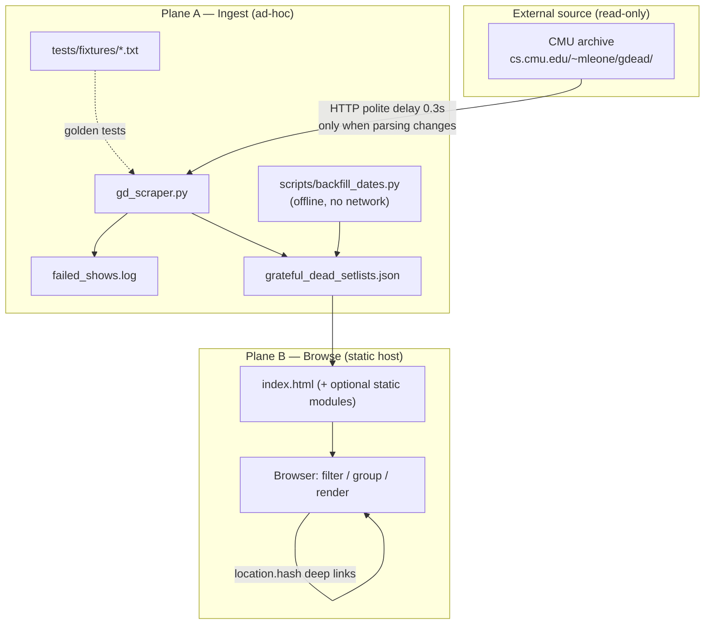
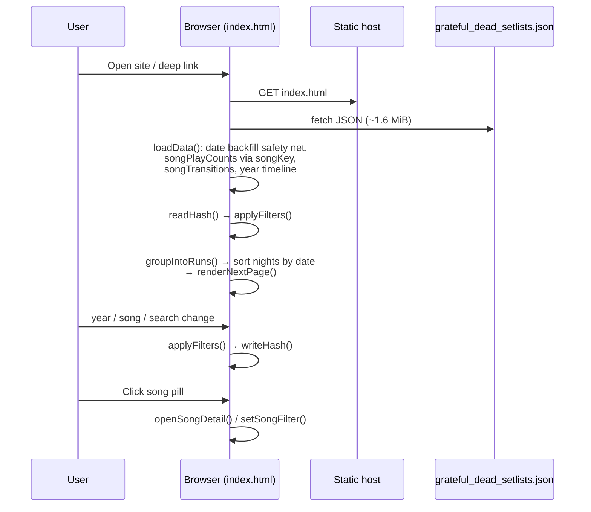
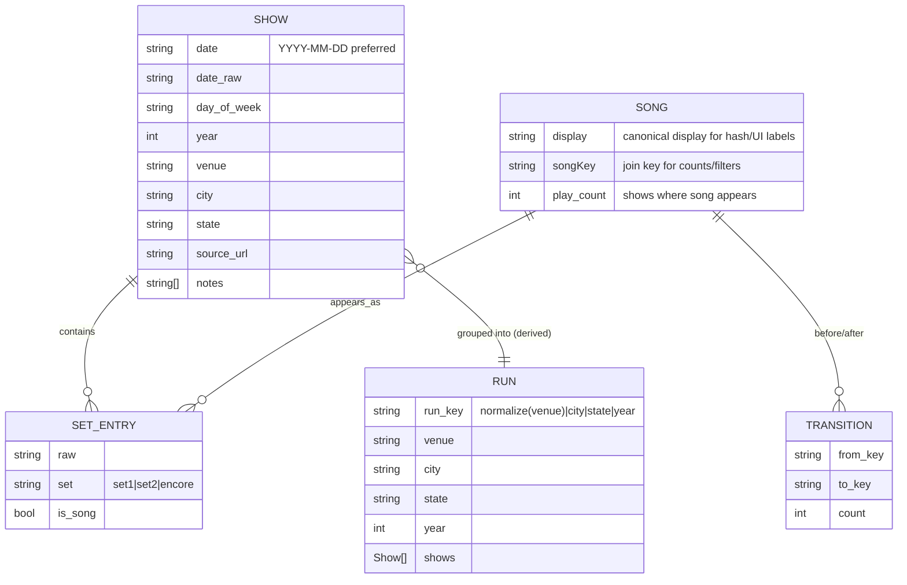

# gdScraper — Formal Architecture & Product Design

| Field | Value |
| --- | --- |
| **Title** | gdScraper Architecture & Product Design |
| **Author** | TBD |
| **Date** | 2026-08-10 |
| **Status** | Ready for Implementation |
| **Workspace** | `/Users/adamwickwire/Code/gdScraper` |
| **Audience** | Maintainers evolving this fan archive |

---

## Overview

gdScraper is a closed-world fan tribute to Mark Leone’s Grateful Dead setlist archive at CMU. It has two planes: a one-shot Python scraper (`gd_scraper.py`) that produces a static JSON corpus, and a single-file browser SPA (`index.html`) that loads that corpus and provides search, year filtering, run-based browsing, song detail, and corpus statistics—entirely client-side.

This document freezes product intent, domain model, data pipeline, frontend architecture, visual system, quality bar, deploy model, and an incremental PR plan. The design deliberately **rejects** multi-tenant backends, app frameworks, and live data platforms: tours ended in 1995, the archive is finite (**1,605** shows, **~1.61 MiB** JSON), and the right product is a deep-linkable, offline-friendly static site that feels like browsing a crate of tapes.

---

## Background & Motivation

### Current state (as of 2026-08-10)

| Artifact | Role | Size / scale |
| --- | --- | --- |
| `gd_scraper.py` | Ingest: crawl year pages → `.txt` shows → JSON | **284** lines |
| `grateful_dead_setlists.json` | Canonical show corpus | **1.61 MiB** (1,688,720 bytes), **1,605** shows, years **1972–1995** |
| `index.html` | Static SPA (HTML + CSS + JS inlined) | **2,497** lines, ~77 KB |
| `mockup.html`, `mockup2.html` | Visual explorations only (hardcoded data) | Not wired to JSON |
| `attribution.md` | Credits Mark Leone, Jerry Stratton, Tim Buller | Not fully surfaced in UI |
| `CLAUDE.md` | Contributor architecture notes | Source of truth for load-bearing constraints |
| `README.md` / `requirements.txt` | — | **Absent today** (to be added in PR plan) |

**Corpus quantities (measured against production `normalize` / `isSong` / `runKey`):**

| Metric | Value | Notes |
| --- | --- | --- |
| Shows | **1,605** | Years 1972–1995 (24 years) |
| Raw setline entries | **35,347** | set1 + set2 + encore strings |
| `isSong()`-true entries | **~30,586** | Production filter in `index.html` |
| Unique songs (normalized titles) | **~985** | After production `normalize` + `isSong` |
| Unique venues (`normalize(venue)`) | **442** | Same key as header stats chip |
| Runs (Map `runKey` grouping) | **874** total · **378** multi-night | **Actual frontend** (`groupIntoRuns` Map) |
| Runs if consecutive-only | **~927** total · **~391** multi | Alternate semantics (see Alternatives) |
| Non-contiguous Map keys | **46** | Same venue/year reappears after other venues |
| Empty `date` in JSON | **1,426** | **1,425** recoverable from `source_url` basename |
| Missing `city` | **74** | Mostly 1987–90 (71/74); also 1979, 1982, 1993 |
| Missing set1 / set2 | **2** / **25** | |
| Entries containing `->` | **1,737** | Transition-suffix noise for identity |
| Multi-night runs non-chrono after URL date recovery | **2** | Night order risk if not re-sorted |

**Empty-city nuance:** Not all missing cities are comma-split parser failures. Some headers are inherently location-unknown (e.g. opaque venue codes like `HJK`, or `[location unknown]`). **Product decision:** show **“Unknown”** in the UI for missing city/state; do **not** over-invest in parser effort for these ~74 shows. PR 8 stays light/optional—document unknowns over aggressive re-scrape.

**Song variant samples (raw display keys, play counts before aliasing):**

- `Playin' in the Band` (451) vs `Playing in the Band` (125)
- Trailing-arrow variants (e.g. `Playing in the Band ->`) inflate uniqueness further

### Pain points

1. **Data quality is uneven.** Most dates are blank in the on-disk JSON; venue/city parsing fails or is unavailable on some headers; song strings include jam markers, multi-song lines with `->`, notes that slipped past scrapers, and spelling variants.
2. **Identity is fragile.** Production indexes key off **raw display strings** with a light `normalize()` only for dedupe/filter equality. That splits canonically-same songs and lets junk inflate “unique song” / bustout lists. (See Song identity contract.)
3. **Single-file SPA is feature-rich but hard to evolve.** Shows view, Statistics view, song detail panel, hash routing, run cards, and random-show all live in one ~2.5k-line file with no tests or modules.
4. **Attribution is repo-only.** `attribution.md` exists; the public UI has no always-visible footer credit—misaligned with fan-tribute ethics and `CLAUDE.md` guidance.
5. **No automated verification.** Scraper quirks (blank-line set breaks, `E:` encores, note lines) are tribal knowledge; early years are messier and will break silently on re-scrape.
6. **Visual system is mid-migration.** Production uses Playfair Display / Crimson Text / DM Sans / IBM Plex Mono; `mockup2.html` proposes a sharper tape-trader look (Righteous + red/orange/yellow accents, Steal Your Face hero).
7. **Hero copy overclaims coverage.** Eyebrow reads `1965 — San Francisco, California` while the CMU corpus (and `attribution.md`) is **1972–1995**.

### Why change anything

The product already works as a personal archive browser. Evolution should make it **trustworthy** (dates in JSON, song identity contract, golden parser tests), **presentable** (attribution-first, accurate copy, polished IA), and **maintainable** (optional multi-file split)—without expanding scope into streaming, social, or multi-band CMS territory.

---

## Goals & Non-Goals

### Goals

1. **Browse every CMU-sourced GD show (1972–1995)** like a crate of tapes: filter by year/song/text, open multi-night runs, follow a song across decades.
2. **Preserve load-bearing architecture:** run grouping (Map `runKey`), hash routing via `applyFilters()`, one-pass derived stats, pagination by runs.
3. **Improve data fidelity** primarily via **offline JSON backfill + scraper parity** (dates from URL/header, cleaner venue/city, song token hygiene) so the on-disk corpus is trustworthy standalone.
4. **Ship a polished, attribution-first static experience** deployable to any static host.
5. **Stay offline-friendly:** single JSON fetch; optional service worker later for true offline.
6. **Evolve code incrementally:** keep single-file v1 until maintainability forces a multi-file static split; frameworks only if multi-view/viz complexity demands them.

### Non-goals

| Non-goal | Rationale |
| --- | --- |
| User accounts, auth, comments, social | No community product surface |
| Live updates / scheduled scrape | Corpus is closed (1995) |
| Audio streaming or tape links as core | Out of scope; external links optional later |
| Multi-band generality | Grateful Dead only |
| Backend API / PocketBase / Tauri | Wrong fit for read-only closed archive |
| Full CMS or editorial workflow | Fan scrape + static presentation |
| Perfect DeadBase-level discography | Source is CMU text archive; light alias map only |
| Server-side rendering frameworks | Static host + client filters is sufficient at this scale |
| Precomputed `{meta, shows, index}` payload (Phase A–C) | Deferred; Option A (flat show array) remains default (see Data pipeline) |

---

## Proposed Design

### Product thesis

> Browse every Grateful Dead show like a crate of tapes—filter by year or song, open a multi-night run, follow a tune across decades. Offline-friendly, deep-linkable, attribution-first. No accounts. No noise.

**Primary user journeys**

1. **Year dive** — Pick `1977` on the timeline → scan runs → expand Winterland nights.
2. **Song chase** — Click *Sugaree* → song detail panel → “Show all shows with this song” → deep link `#song=Sugaree`.
3. **Venue / free text** — Search “Capitol” or “Cornell” → runs grid.
4. **Random immersion** — “Take Me to a Show” (already in `index.html`) clears filters and expands a random run card.
5. **Lore / stats** — Statistics tab for openers, closers, encores, venues, iconic transitions.

### Architecture: two-plane static system



**Hard decision:** Do **not** default to Tauri, SvelteKit, PocketBase, or a custom API. At ~1.6 MiB and 1,605 shows, client-side filter/group/render is well within budget (parse once, paginate at `PAGE_SIZE = 50` runs → first page is **50 of 874** run cards, not ~900).

### High-level data flow (runtime)



### Domain model



#### Show (persisted)

Produced by `parse_setlist_text()` in `gd_scraper.py`. Current fields:

```json
{
  "date": "1995-02-19",
  "date_raw": "2/19/95",
  "day_of_week": "Sunday",
  "year": 1995,
  "venue": "Delta Center",
  "city": "Salt Lake City",
  "state": "UT",
  "source_url": "https://www.cs.cmu.edu/~mleone/gdead/dead-sets/95/....txt",
  "sets": { "set1": ["..."], "set2": ["..."], "encore": ["..."] },
  "notes": ["* guest notes..."]
}
```

**Invariants (target):**

- `year` always from year-index page (`72.html` → 1972), never from ambiguous two-digit file years alone. Year-link mapping in `get_year_links`: `yy >= 72 → 1900+yy`, else `2000+yy` (only 72–95 appear in practice).
- `date` is ISO `YYYY-MM-DD` when recoverable (see **Date recovery algorithm**).
- `date_raw` / `day_of_week` remain **archive header text only**—do not invent them from URL recovery.
- `sets.*` are ordered arrays of raw line tokens; not all tokens are songs.

#### Date recovery algorithm

Precedence when building or backfilling `date`:

| Priority | Source | Rule |
| --- | --- | --- |
| 1 | Header `date_raw` via `parse_date()` | If parse yields ISO `YYYY-MM-DD`, use it |
| 2 | `source_url` basename | Match `(\d{1,2})-(\d{1,2})-(\d{2,4})\.txt$`; for 2-digit year always prefix `19` (valid for this 1972–1995 corpus only) |
| 3 | Unrecoverable | Leave `date` as `""` |

**Conflict rule:** If header-derived ISO and URL-derived ISO **both exist and disagree**, keep **header**, log a warning (scraper / backfill script). Measured on current corpus: **0** year mismatches between filename YY and `show.year` for recoverable URLs.

**`parse_date` nuance:** On failure, `parse_date()` returns the **raw** string (not always `""`). Downstream ISO checks must accept only `^\d{4}-\d{2}-\d{2}$`, not “truthy date”.

**Do not invent** `day_of_week` from a recovered date without an explicit calendar library decision (out of scope for Phase A—leave empty when header lacked it).

#### Sort order after date recovery (load-bearing side effect)

`gd_scraper.py` today ends with:

```python
all_shows.sort(key=lambda x: x.get("date", ""))
```

That key places `""` **before** any ISO date (`'' < '1972-01-02'`). After backfill, **exactly one** show is expected to remain undated; with the current key it would lead the entire corpus. **Do not reuse this key as-is.**

**Canonical sort (empty last)** — shared by scraper, offline backfill, and frontend night sort:

```python
def show_date_sort_key(show: dict) -> tuple:
    d = show.get("date") or ""
    # Non-ISO / empty → last; ISO dates ascending among the rest
    is_iso = bool(re.fullmatch(r"\d{4}-\d{2}-\d{2}", d))
    return (0 if is_iso else 1, d if is_iso else "")

all_shows.sort(key=show_date_sort_key)
```

```javascript
// Frontend: same empty/non-ISO-last semantics
function showDateSortKey(show) {
  const d = show.date || '';
  const isIso = /^\d{4}-\d{2}-\d{2}$/.test(d);
  return [isIso ? 0 : 1, isIso ? d : ''];
}
function sortShowsByDate(shows) {
  return shows.slice().sort((a, b) => {
    const [a1, a2] = showDateSortKey(a);
    const [b1, b2] = showDateSortKey(b);
    return a1 - b1 || (a2 < b2 ? -1 : a2 > b2 ? 1 : 0);
  });
}
// After groupIntoRuns (or at end of groupIntoRuns for each run):
//   run.shows = sortShowsByDate(run.shows);
```

Today **1,426/1,605** dates are `""`, so the legacy sort is nearly a no-op (stable order ≈ scrape order). After ISO dates are filled:

1. Committed JSON becomes **chronological with empty/non-ISO last** (large order-only churn in PR 3).
2. `groupIntoRuns` Map insertion order follows first-seen show in filtered/sorted list → **run card pagination order changes**.
3. Night order within a run depends on push order into the Map’s `shows[]` array **unless** the frontend re-sorts (required).

**Decisions:**

| Layer | Decision |
| --- | --- |
| Scraper / offline backfill | **Always** sort with `show_date_sort_key` (ISO ascending, **empty/non-ISO last**) after recovery — replace the bare `x.get("date","")` key |
| Frontend defense in depth | After `groupIntoRuns` (or inside it), **`run.shows = sortShowsByDate(run.shows)`** so multi-night cards stay chronological if JSON is ever re-scraped unsorted. **Ships in PR 2** (`index.html`) |
| Client-only backfill today | Does **not** re-sort `allShows`—another reason to put dates + sort into the on-disk corpus |
| Measured risk | **2** multi-night Map runs are already non-chronological after URL recovery alone |

PR 3 review notes must call out large JSON order churn as expected. Residual undated show(s) appear at **end** of the file, not the start.

#### Run (derived, not persisted)

```javascript
// index.html — runKey / groupIntoRuns (preserve Map semantics)
function runKey(show) {
  return [normalize(show.venue), normalize(show.city), normalize(show.state), show.year].join('|');
}
```

- **Semantics:** All shows sharing the same venue/city/state/year key form one run card (Map merge), including the **46** non-contiguous return engagements in a year.
- **Counts:** **874** runs, **378** multi-night under Map semantics. Consecutive-boundary grouping would yield ~927 / ~391 (not what the UI does).
- **UI copy (required):** Do not imply a single continuous “stand” when labeling. Prefer:

  - Card badge: **`N shows · Y songs`** or **`N shows at this venue in {year}`**
  - Expanded nights: prefer **date labels** (`Night — Sunday, 1977-05-08`) over implying Night 1…N is one unbroken residency. Keep “Night k” only as an index after chronological sort, optionally with gap markers later.

- **UI contract:** Cards can hold N nights; any card renderer must respect multi-show `buildRunCard` / `buildRunBody`.

#### Song (derived) — identity contract (implementation-complete)

Production today is **inconsistent** (implementers must migrate carefully):

| Path | Today’s keying |
| --- | --- |
| `songPlayCounts` / `songTransitions` object keys | **Raw display string** |
| Per-show dedupe in count pass | `normalize(song)` |
| Rare pill (`songPlayCounts[s] < 10`) | Lookup by **raw pill string** |
| `applyFilters` song filter | Exact `normalize` equality on **any** set entry (no `isSong`, no arrow strip) |
| Hash `#song=` / `setSongFilter` | **Display** string from pill |

**Target contract:**

```
stripTrailingArrow(raw)  := trim; remove trailing /\s*->\s*$/ repeatedly
normalize(s)             := lower + fold ‘ ’ → '   (existing)
alias(n)                 := lookup small map, else n
songKey(raw)             := alias(normalize(stripTrailingArrow(raw)))
```

| Concern | Rule |
| --- | --- |
| Join key | `songKey(raw)` for counts, transitions, rare lookup, song filter, song detail match |
| Display map | `displayByKey[songKey] = first-seen raw after stripTrailingArrow` (or curated alias display) |
| Hash `#song=` | Persist **canonical display** string (value from `displayByKey`), not the opaque key—friendlier URLs |
| Filter path | `songKey(entry) === songKey(songFilter)` for any set entry (still **no** `isSong` requirement, matching today: junk tokens can still match if user deep-links them) |
| Pills | Render **raw archive text** unchanged; optional `title` attribute with canonical display when different |
| Play count | Still **per-show unique** by `songKey` (one count per show even if song appears twice) |
| Rare | `playCountByKey[songKey(raw)] < 10` |
| Transitions | Edges between consecutive `isSong` entries, keyed by `songKey` |

**Initial alias pairs (minimum for PR 5):**

| Alias key (after normalize + strip) | Canonical display |
| --- | --- |
| `playin' in the band` / `playing in the band` | `Playin' in the Band` |
| `playin' reprise` / `playing reprise` | `Playin' Reprise` |

Expand only with curated pairs (no ML). Document new aliases in PR description with before/after play counts.

**Deep-link migration:** Old links like `#song=Playing%20in%20the%20Band` still work because filter runs `songKey(songFilter)` which aliases to the same key as `Playin' in the Band`. After `writeHash`, prefer rewriting to canonical display when the user changes filters (acceptable replaceState).

**Risk:** Wrong aliases merge distinct songs—mitigate with small map + count-diff review in PR 5 acceptance.

### Data pipeline (Plane A)

#### Scrape topology

```
setlists.html
  → {72..95}.html          # year index; year integer from filename mapping
    → dead-sets/{yy}/*.txt # one show each
```

Config in `gd_scraper.py`:

| Constant | Value | Purpose |
| --- | --- | --- |
| `BASE_URL` | `https://www.cs.cmu.edu/~mleone/gdead/` | Archive root |
| `OUTPUT_FILE` | `grateful_dead_setlists.json` | Corpus |
| `FAILED_LOG` | `failed_shows.log` | Failed fetch/parse |
| `DELAY` | `0.3` s | Polite rate limit (~10 min full run) |

#### Parser contract (`parse_setlist_text`)

Documented quirks (must remain covered by golden tests):

1. **Set breaks = blank lines**, not “Set II” headers. First blank after set1 songs → set2.
2. **Encore** = line matching `^E\s*:` or `^Encore\s*:` (case-insensitive); multi-song split on `/` or `,`.
3. **Notes** = lines starting with `*` or `(`; also non-letter junk after encore (`current_set == "encore"` branch).
4. **Header line** = venue/city/state + parenthetical day/date via `parse_venue_line()`.
5. **Year** = parameter from year page, not header.
6. **Year links** (`get_year_links`): `^(\d{2})\.html$` → `1900+yy` if `yy >= 72` else `2000+yy`.

#### Pipeline improvements (ordered)

1. **Offline date backfill (preferred for corpus fix)** — pure function over existing JSON using `source_url` + header precedence; **sort with `show_date_sort_key` (empty last)**; write JSON; **no CMU network**. Covers 1,425/1,426 empty dates.
2. **Same logic inside scraper** — for any future crawl; replace bare `sort(key=lambda x: x.get("date",""))` with `show_date_sort_key`.
3. **Client backfill + night sort (PR 2)** — keep date backfill as safety net; **require** `sortShowsByDate` on each `run.shows` after `groupIntoRuns`.
4. **Venue/city (light / optional)** — UI shows **“Unknown”** for missing city/state. Do not over-invest in parser effort for inherently location-unknown headers (~74 shows). PR 8 optional; prefer documenting unknowns over re-scrape.
5. **Setline token hygiene** — primarily in frontend identity layer (strip `->`); scraper may optionally strip trailing arrows later—do not aggressively split multi-song lines without fixtures.
6. **Failed log + summary stats** — empty dates remaining, empty cities, empty set1, date conflicts logged.
7. **Golden fixtures** — representative `.txt` under `tests/fixtures/`.

#### Precomputed index / wrapped JSON (deferred)

**Option A (default, Phases A–C):** Keep flat JSON **array** of shows. Frontend derives indexes.

**Option B (future ADR only):** Wrap `{ meta, shows, index }`. **Not** on the critical path. If ever pursued:

1. Ship dual-shape `loadData()` **first** (accept array or `{shows}`).
2. Then change on-disk shape in a separate PR.

Do **not** implement Option B in the PR plan below. Open Question closed: **defer**.

### Frontend architecture (Plane B)

#### Current module map (logical; still one file)

| Concern | Functions / state | Approx. lines |
| --- | --- | --- |
| State | `allShows`, `filteredShows`, `groupedRuns`, `renderedCount`, `PAGE_SIZE=50`, filters | ~1463–1478 |
| Helpers | `getAllSongs`, `normalize`, `isSong`, `escHtml`, `escAttr` | ~1496–1532 |
| Load / derive | `loadData` | ~1535–1621 |
| Year UI | `buildYearTimeline`, `selectYear` | ~1624–1668 |
| Hash routing | `readHash`, `writeHash` | ~1696–1721 |
| Runs | `runKey`, `groupIntoRuns` | ~1724–1744 |
| Filters | `applyFilters`, `updateResultsCount` | ~1747–1781 |
| Render | `renderNextPage`, `buildRunCard`, `buildRunBody`, `renderSet` | ~1784–1918 |
| Song filter | `setSongFilter`, badge helpers | ~1940–1953 |
| Stats view | `buildStatsView`, bar/trend cards | ~2022–2248 |
| Song detail | `openSongDetail`, `buildSongDetailHTML` | ~2257–2418 |
| Random | random-show button handler | ~2441–2487 |

When Phase D splits files, update this map in `CLAUDE.md`. Line numbers are anchors for today only.

#### State & routing contract (must not break)

Filters: `searchQuery`, `yearFilter`, `songFilter`.

- Serialized to `location.hash` as `URLSearchParams`: `#song=Sugaree&year=1977&q=capitol`
- **All filter mutations must call `applyFilters()`**, which resets `renderedCount`, rebuilds `groupedRuns`, re-renders, and `writeHash()`.
- `hashchange` **clears** all three filters and input UI, then `readHash()` + `applyFilters()` (full replace from hash—not merge).
- Deep links are a product feature, not a nice-to-have.

#### Filtering semantics (production + target)

```
filteredShows = allShows
  ∩ year: exact int match on show.year
  ∩ song: any set entry where songKey(entry) === songKey(songFilter)
        (today: normalize equality; no isSong gate — junk tokens can match)
  ∩ q: substring on venue | city | state | any song string
     (does NOT search date, notes, or source_url unless product expands later)
→ groupIntoRuns(filteredShows)
→ sort each run.shows via sortShowsByDate (empty/non-ISO last; required, PR 2)
→ paginate PAGE_SIZE=50 runs
```

**Random show (existing):** Clears all filters, `applyFilters()`, picks random show, finds run index, recursively clicks Load More until card exists, expands. Known side effect: may spam Load More for high indices. Stretch PR 11 may jump-render to index without recursive clicks.

#### Rendering & performance budget

| Metric | Target |
| --- | --- |
| JSON download | ~1.61 MiB once; gzip on host often &lt;400 KB |
| Init pass | &lt;100 ms typical desktop after parse |
| Initial paint | First **50 of 874** run cards |
| Filter re-apply | Full refilter of 1,605 shows; keep simple |
| DOM | Avoid rendering all ~874 run cards at once |

#### UX information architecture

```
┌──────────────────────────────────────────────────────────┐
│ HERO                                                     │
│  optional Steal Your Face (hero only) · title · tagline  │
│  copy: 1972–1995 archive (not 1965) · corpus stats       │
│  Random show CTA                                         │
├──────────────────────────────────────────────────────────┤
│ STICKY CONTROLS                                          │
│  year timeline (ALL + '72…'95 bars)                      │
│  search · active song chip · clear · results count       │
├──────────────────────────────────────────────────────────┤
│ TABS: Shows | Statistics                                 │
├─────────────────────────────┬────────────────────────────┤
│ Run cards (paginated)       │ Most Played sidebar        │
│  “N shows at venue in year” │ (collapsible)              │
│  expand → dated nights      │                            │
│  song pills → detail panel  │                            │
├─────────────────────────────┴────────────────────────────┤
│ FOOTER (always visible): attribution + disclaimer        │
└──────────────────────────────────────────────────────────┘
+ Song detail slide-over (#song-detail-panel)
```

**Required UI changes vs production:**

1. **Footer attribution** before public deploy.
2. **Hero copy** matches CMU slice (**1972–1995**).
3. **Run microcopy** does not over-claim consecutive stands.
4. Visual converge to mockup2 accents; **Righteous for H1 only**, DM Sans body, IBM Plex Mono for dates/stats (Playfair/Crimson retired from hero).
5. Steal Your Face / bears **only in hero**.
6. Song detail: **focus trap required** (focus panel on open, restore on close, Escape already present).

### Visual design system

**Source of truth for target look:** `mockup2.html` (Righteous / DM Sans / IBM Plex Mono; red `#e63328`, orange `#f58220`, yellow `#f5c518` on near-black `#0a0a0a`).

**Font decision (resolved):** **Righteous for H1 only**; DM Sans for UI body; IBM Plex Mono for dates, counts, timeline. Drop Playfair Display and Crimson Text from production to reduce font payload and match mockup2.

**Fonts / offline:** Google Fonts remain a third-party network + privacy dependency until self-hosted. **PR 6:** add `font-display: optional` on the Google Fonts `link`/`@import` only (no self-host required). **Self-host woff2 under `fonts/`** when adding the service worker (**PR 12**) or earlier if privacy priority rises. Fallback: system UI stack if fonts fail.

**Tokens:** Keep production CSS variable structure (`--bg`, `--card`, `--border`, `--red`, `--orange`, `--gold`/`--yellow`, `--teal` for rare, text hierarchy). Radius 2–8px; grain overlay subtle.

### Quality & testing

#### Scraper / backfill

| Layer | What |
| --- | --- |
| Unit | `parse_date`, `parse_venue_line`, `parse_setlist_text`, `recover_date_from_url` |
| Golden | Full `.txt` → JSON snapshots for messy early + clean late years |
| Offline backfill | Script dry-run stats: empty dates before/after |
| Smoke | Optional network-marked year index test |
| Ops | `failed_shows.log`; non-zero exit if failure rate &gt;1% on full crawl |

```
tests/
  fixtures/
    72/1-2-72.txt
    77/...
  test_parse_setlist.py
  test_date_recovery.py
scripts/
  backfill_dates.py
requirements.txt          # runtime: requests, beautifulsoup4 (pinned)
requirements-dev.txt      # pytest
```

#### Frontend

- Manual checklist per relevant PR (linked in PR plan acceptance).
- Optional pure-function tests for `songKey` / `normalize` / `isSong` / `runKey` if extracted.
- No visual regression suite for v1.

### Deployment

| Concern | Choice |
| --- | --- |
| **Host (chosen)** | **GitHub Pages** (static site from this repo; project or user site as operator prefers) |
| Artifacts | `index.html`, `grateful_dead_setlists.json`, optional `css/` `js/` `fonts/`; not `venv/`, mockups optional |
| HTTPS | Provided by GitHub Pages; required for modern browsers / future SW |
| **JSON caching (chosen default)** | `Cache-Control: max-age=3600, must-revalidate` on JSON where host allows (or rely on Pages defaults + revalidate); bump via filename only if ever hashed—**default is moderate TTL + revalidate**, not content-hash filenames (avoids HTML churn). HTML: short TTL or revalidate |
| file:// | Unsupported—document `python -m http.server 8000` in README |
| Env / secrets | None |

**Service worker (PR 12, stretch) — cache list:**

- Precache: `index.html`, `grateful_dead_setlists.json`, `css/*`, `js/*`, and **self-hosted `fonts/*`** (self-host fonts as part of PR 12 so offline does not depend on Google CDN)
- Update story: on new deploy, `skipWaiting` + optional “Refresh for new setlists” prompt when JSON byte size/ETag changes; do not silently serve stale corpus forever
- Deploy target remains **GitHub Pages**

**Rollback:** Redeploy previous static artifacts; data and UI version together in git.

### Phased roadmap

| Phase | Name | Outcome |
| --- | --- | --- |
| **A** | Solidify domain | Dates in JSON + sort; song identity contract; run microcopy; hero coverage accuracy |
| **B** | UX polish | Footer attribution; visual Righteous/mockup2; a11y focus trap |
| **C** | Data quality | Golden fixtures; venue/city fixes; failed-log thresholds; **re-scrape only if parse changes** |
| **D** | Optional split | ES modules + CSS file when pain exceeds benefit |
| **E** | Stretch | SW offline; transition graph; this day in history; smarter random |

Phases A–C are the default commitment. D–E are gated.

#### Definition of Done (Phases A–C)

| Phase | Done when |
| --- | --- |
| **A** | Empty `date` count in JSON **≤ 1**; JSON sorted ISO-ascending with **empty last** (`show_date_sort_key`); client backfill + **`run.shows` night sort** in place; run cards say “N shows…” not “stand”; hero claims **1972–1995**; `songKey` contract shipped with Playin'/Playing merged in Most Played; deep link `#song=Playing%20in%20the%20Band` still filters |
| **B** | Footer always visible (including mobile width) with Leone / Stratton / Buller + non-commercial disclaimer matching `attribution.md`; Righteous H1 + mockup2 accents; song detail focus trap works with keyboard |
| **C** | `pytest` green on **≥ 7** fixtures (including year-link mapping docs/test); missing city/state render as **“Unknown”** (no heavy venue-parser investment required); `requirements.txt` pins present; re-scrape only if parse fixes truly need it (PR 8 optional) |

---

## API / Interface Changes

There is no HTTP API. Interfaces are:

### 1. Corpus file contract

**Current and Phases A–C:** JSON **array** of show objects only.

```javascript
async function loadData() {
  const resp = await fetch('grateful_dead_setlists.json');
  allShows = await resp.json(); // array
  // date backfill safety net; sort nights when grouping
}
```

Wrapped `{ meta, shows, index }` is **out of scope** until a future ADR (see deferred Option B).

### 2. Hash query interface (public)

| Param | Meaning | Example |
| --- | --- | --- |
| `year` | Exact year filter | `#year=1977` |
| `song` | Canonical **display** string (filter via `songKey`) | `#song=Sugaree` |
| `q` | Free-text search (venue/city/state/songs only) | `#q=Winterland` |

**Compatibility:** Do not rename params.

### 3. Scraper / backfill CLI

```bash
source venv/bin/activate
python scripts/backfill_dates.py   # offline rewrite + sort (preferred for date PR)
python gd_scraper.py               # full crawl — only when parse/venue logic changes
pytest
```

Optional future flags: `--out`, `--delay`, `--limit-year` for tests.

---

## Data Model Changes

### Show object

| Field | Change |
| --- | --- |
| `date` | Offline backfill + scraper fill ISO per algorithm; sort corpus by date |
| `date_raw`, `day_of_week` | Unchanged archive text; not invented from URL |
| `venue`, `city`, `state` | Improve parser later; no schema change |
| `sets` | Unchanged shape |
| `notes` | Unchanged |
| `source_url` | Unchanged; load-bearing for recovery |

No required new fields for Phases A–C.

### Migration strategy

1. **Offline backfill + sort** → commit JSON (large order churn expected).
2. Keep client-side date backfill + add per-run night sort.
3. Song identity is **frontend-only** migration (no JSON schema change).
4. No user data to migrate.
5. Full CMU re-scrape **not** required for date fix; reserve for venue/set parser changes.

### Storage estimates

| Item | Estimate |
| --- | --- |
| Shows JSON | ~1.61 MiB raw |
| Gzipped transfer | ~300–500 KB typical |
| Browser memory | Low tens of MB after parse + 50 cards |

---

## Alternatives Considered

### 1. Full SvelteKit + PocketBase + Tauri stack

| Pros | Cons |
| --- | --- |
| Familiar personal stack | Overkill for closed static corpus |

**Decision:** Reject as default.

### 2. Server API + dynamic backend

| Pros | Cons |
| --- | --- |
| Smaller initial payload | Ops cost; no win at 1.6 MiB |

**Decision:** Reject.

### 3. Consecutive-only run grouping

| Pros | Cons |
| --- | --- |
| Matches “stand” language | ~927 runs vs 874 Map; changes UX; needs solid dates |

**Metrics:** Consecutive-boundary ≈ **927** runs / **391** multi; Map (current) = **874** / **378** with **46** non-contiguous merges.

**Decision:** Keep Map-by-key; fix microcopy instead.

### 4. Immediate multi-file / framework split

**Decision:** Defer to Phase D when friction is real.

### 5. Aggressive song canonicalization database

**Decision:** Light `songKey` + small alias map only.

### 6. Client-only date backfill remains sole owner (status quo)

| Pros | Cons |
| --- | --- |
| Zero JSON churn; no scraper work | On-disk corpus untrustworthy; first/last dates wrong until JS runs; scraper `sort` stays meaningless; song detail / any non-JS consumer sees empty dates; 2 multi-night runs can show wrong night order |

**Decision:** **Reject as end state.** Promote recovery into offline backfill + scraper; keep client backfill as safety net only.

### 7. Full CMU re-scrape for every data PR

| Pros | Cons |
| --- | --- |
| Picks up remote fixes | Unnecessary for URL-based dates; politeness risk; ~10 min; conflicts with “scrape sparingly” |

**Decision:** Prefer **offline JSON post-process** for dates; re-scrape only when set/venue **parser logic truly changes**—not for the optional light PR 8 “Unknown” documentation path.

---

## Security & Privacy Considerations

| Topic | Assessment |
| --- | --- |
| User data | None collected |
| XSS | Escape via `escHtml` / `escAttr` for dynamic show/song strings; `innerHTML` only with escaped pieces |
| External links | `source_url` with `target="_blank" rel="noopener"` |
| **Google Fonts CDN** | Third-party network + privacy dependency; **PR 6** mitigates with `font-display: optional`; **self-host in PR 12** (or earlier if privacy priority rises); optional SRI while CDN remains |
| Scraping ethics | `DELAY=0.3`; ad-hoc not cron; offline backfill preferred; re-scrape sparingly |
| Legal / framing | Fan tribute; UI attribution + disclaimer; not affiliated with GD estate |
| Supply chain | Pin `requests`, `beautifulsoup4` in `requirements.txt` (PR creates it); pytest in `requirements-dev.txt` |
| CSP (optional) | Inline script OK for v1; stricter CSP after Phase D split |

**Threat model:** Low. Primary risks: malicious upstream setlist text (escape), commercial misuse (attribution), abusive scrape rates (operator discipline + offline-first data fixes).

---

## Observability

| Signal | Mechanism |
| --- | --- |
| Scrape progress | `logging` INFO in `gd_scraper.py` |
| Backfill stats | Script prints empty-date before/after, conflict count |
| Scrape failures | `failed_shows.log` |
| Client load failure | `loadData().catch` in `#loading` |
| Metrics that matter | Show count, empty-date count, failed scrape count, alias merge diffs |

No production APM. Optional privacy-friendly analytics only if operator opts in.

---

## Rollout Plan

1. **Local validation:** `python -m http.server 8000`; per-PR acceptance criteria.
2. **Data PRs separate from UI PRs** when JSON diffs are large (order churn).
3. **Prefer offline backfill** over CMU crawl for date work.
4. **Feature flags:** Not required for core; SW behind careful registration.
5. **Staged deploy:** Preview → deep-link sanity → production.
6. **Rollback:** Previous git tag / host deploy.
7. **Re-scrape policy:** Manual; ~10 minutes; **not** for date-only fixes; document in README.

---

## Risks

| Risk | Severity | Mitigation |
| --- | --- | --- |
| CMU archive format drift / downtime | Medium | Golden fixtures; last-good JSON in git; offline backfill path |
| Date recovery wrong / conflicts | Medium | Header-prefer precedence; log conflicts; ISO-only accept |
| Sort-order JSON churn hides real diffs | Medium | PR 3 notes order-only expected; optional sorted-key review |
| Implementer reuses bare `sort(key=date)` → empty first | Low–Med | Explicit `show_date_sort_key`; PR 2 acceptance forbids empty at index 0 |
| Song alias / deep-link regressions | Medium | `songKey` filter accepts old display forms; acceptance tests Playin'/Playing |
| Map-based runs misread as one stand | Low | Microcopy “N shows at this venue in {year}” |
| Single-file merge conflicts | Medium | Phase D when needed |
| Attribution missing | High for public launch | Footer PR before public deploy |
| Google Fonts blocks offline / privacy | Low–Med | `font-display: optional` in PR 6; self-host fonts with SW in PR 12 |
| Over-scoping frameworks | Medium | Explicit non-goals; Phase E gate |

---

## Open Questions

**None remaining.** All product/ops choices needed for implementation are resolved below (and in Key Decisions).

**Resolved decisions:**

| Topic | Resolution |
| --- | --- |
| Public host | **GitHub Pages** |
| Missing city/location (~74 shows) | UI shows **“Unknown”** only; no heavy parser investment; PR 8 light/optional |
| Fonts | **`font-display: optional` in PR 6**; **self-host when PR 12 (SW)** or if privacy priority rises |
| Display font | **Righteous H1 only**; DM Sans + IBM Plex Mono |
| Song hash value | Canonical **display** string; match via `songKey` |
| Wrapped JSON / index | **Defer** Option B; flat array only in A–C |
| Hero “1965” | **Must** match CMU slice **1972–1995** |
| Focus trap | **Required** in PR 9, not optional |
| Date ownership | Offline backfill + scraper; not client-only forever |

---

## Key Decisions

| Decision | Rationale |
| --- | --- |
| **Two-plane architecture (scraper + static SPA)** | Closed corpus; no write path |
| **No Tauri / SvelteKit / PocketBase by default** | Wrong complexity class for ~1.6 MiB read-only archive |
| **Run = Map keyed by `venue\|city\|state\|year` (874 runs)** | Existing UX; 46 non-contiguous merges kept; consecutive-only is alt (~927) |
| **Run UI copy = “N shows at venue in year”** | Avoid false “stand” language |
| **All filters via `applyFilters()` + hash** | Deep links and state consistency |
| **Stats derived once on load** | Avoid O(n) work per render |
| **Pagination by runs (`PAGE_SIZE=50`)** | Cap DOM (50 of 874) |
| **`songKey` contract + small alias map** | Fix Playin'/Playing and `->` without DeadBase |
| **Hash `#song=` = canonical display; filter via `songKey`** | Friendly URLs + alias-safe matching |
| **Date recovery: header ISO &gt; URL basename &gt; empty; no invented DOW** | Correct precedence; measured 1,425 recoverable |
| **Offline backfill + sort preferred over full re-scrape for dates** | Politeness; 0 network needed; sort becomes meaningful |
| **Corpus + night sort = empty/non-ISO last via `show_date_sort_key`** | Bare `sort(key=date)` puts `""` first; residual undated show must not lead the file |
| **Frontend sorts `run.shows` by date (PR 2 merge gate)** | Defense in depth if JSON re-scraped unsorted; 2 multi-night runs already non-chrono after URL recovery |
| **Flat JSON array only (Option B deferred)** | Avoid dual-loader complexity until needed |
| **Attribution always visible before public launch** | Fan-tribute ethics |
| **Public copy = 1972–1995** | Match corpus and `attribution.md`, not 1965 |
| **Righteous H1; mockup2 accents; hero-only iconography** | Tape-trader look; scannable setlists |
| **Focus trap required for song detail** | Keyboard a11y |
| **JSON cache: moderate TTL + revalidate** | Simple default without hashed filenames |
| **Deploy on GitHub Pages** | Chosen static host; HTTPS included; matches no-backend model |
| **Missing city → UI “Unknown”; PR 8 light/optional** | ~74 headers often inherently unknown; avoid re-scrape theater |
| **Fonts: `font-display: optional` (PR 6); self-host with SW (PR 12)** | Privacy/offline path without blocking visual polish |
| **Single-file until forced to split** | Ship polish before structure churn |
| **Golden parser tests + pinned requirements** | Re-scrape must not regress silently |
| **Phased A–C default; D–E gated** | Incremental mergeable PRs |

---

## References

- Source archive: https://www.cs.cmu.edu/~mleone/gdead/setlists.html
- Repo: `gd_scraper.py`, `index.html`, `grateful_dead_setlists.json`, `attribution.md`, `CLAUDE.md`
- Design explorations: `mockup.html`, `mockup2.html`
- Related: DeadBase, Tour-by-Tour Project (see `attribution.md`)

---

## PR Plan

Incremental, independently reviewable PRs. Each includes **acceptance criteria** (merge gates). Order is dependency-aware (revised post-review).

### PR 1 — Corpus contract, hero copy, run microcopy

- **Files:** `CLAUDE.md`; `index.html` (hero eyebrow/subtitle; run card badge copy in `buildRunCard` / `buildRunBody`); add **`README.md`** (commands, `python -m http.server 8000`, non-goals, re-scrape policy)
- **Dependencies:** None
- **Description:** Codify show/run/song invariants, hash params, Map vs consecutive run counts (874 vs ~927), date recovery notes. Fix hero to **1972–1995**. Change card labeling to **“N shows · …” / “N shows at this venue in {year}”**; night headers prefer dates over pure “Night k” residency implication.
- **Acceptance:**
  - Hero does not claim 1965 as corpus start; shows 1972–1995 or equivalent accurate range.
  - Multi-show cards do not say “stand” / imply unbroken residency solely via “Night 1…N” without dates.
  - README documents serve command and that `file://` will not load JSON.
  - `CLAUDE.md` states Map run semantics and `applyFilters` contract.

### PR 2 — Date recovery: pure functions + offline backfill + scraper parity + client night sort

- **Files:** `gd_scraper.py` (shared `recover_date` / `show_date_sort_key`); `scripts/backfill_dates.py`; `index.html` (`sortShowsByDate` after `groupIntoRuns`; keep `loadData` date backfill); unit tests optional here or PR 7; **do not require network**
- **Dependencies:** PR 1 helpful for docs
- **Description:** Implement date algorithm (header ISO → URL basename → `""`; conflict = keep header + log). Offline script rewrites existing JSON, sorts with **`show_date_sort_key` (ISO ascending, empty/non-ISO last)**, prints before/after empty-date counts. Scraper uses same recovery + sort helpers (replace bare `sort(key=lambda x: x.get("date",""))`). Client: keep date backfill; **ship `run.shows` night sort** so multi-night cards stay chronological if corpus order regresses.
- **Acceptance:**
  - `python scripts/backfill_dates.py` with no network leaves empty dates **≤ 1**.
  - Winterland `.../72/1-2-72.txt` → `date` **`1972-01-02`**.
  - Output JSON is sorted ISO-ascending with **empty/non-ISO last** (not bare `key=date`; residual undated show is **not** index 0).
  - Scraper `main()` uses `show_date_sort_key` (or equivalent tuple key), not `lambda x: x.get("date","")` alone; `DELAY` unchanged.
  - `date_raw` / `day_of_week` not invented when only URL recovery applies.
  - `index.html`: after `groupIntoRuns`, each multi-night `run.shows` is ordered by ISO `date` ascending (empty last)—verifiable by code review or a temporary log/assert in dev.

### PR 3 — Commit backfilled + sorted JSON corpus

- **Files:** `grateful_dead_setlists.json` only
- **Dependencies:** PR 2
- **Description:** Commit script output. Expect **large order-only diff**. No full CMU re-scrape.
- **Acceptance:**
  - Empty `date` count ≤ 1 on disk.
  - Spot-check: `1-2-72` → `1972-01-02`; a known 1995 show keeps header date if present.
  - File still a **JSON array** of 1,605 objects.
  - PR description notes chronological reorder is intentional.

### PR 4 — Footer attribution & disclaimer

- **Files:** `index.html` (footer markup/CSS); content from `attribution.md`
- **Dependencies:** None (parallel with 2–3)
- **Description:** Always-visible footer: Mark Leone / CMU, Jerry Stratton, Tim Buller, non-commercial fan-tribute disclaimer, link to source, coverage 1972–1995.
- **Acceptance:**
  - Footer visible at desktop and **mobile (&lt;960px)** without opening menus.
  - Names Leone, Stratton, Buller present; non-commercial / not-affiliated disclaimer present.
  - Coverage text does not contradict 1972–1995.
  - Source link works (`cs.cmu.edu/.../setlists.html` or equivalent).

### PR 5 — Song identity: `songKey`, aliases, filter/hash migration

- **Files:** `index.html` (`normalize`, new `stripTrailingArrow` / `songKey` / `displayByKey`, `loadData` counts/transitions, `applyFilters`, rare pills, song detail, `writeHash` canonical display)
- **Dependencies:** PR 3 recommended (first/last dates); **can ship after offline backfill alone**
- **Description:** Implement identity contract table. Minimum aliases: Playin'/Playing in the Band (+ Reprise). Pills keep raw text.
- **Acceptance:**
  - Most Played / stats show **merged** Playin' + Playing counts (single row, higher count than 451 alone).
  - `#song=Playing%20in%20the%20Band` and `#song=Playin'%20in%20the%20Band` both filter the same show set.
  - Rare highlighting uses key-based counts (arrow suffix pills don’t all look rare incorrectly).
  - Manual: open song detail on Playin' → transitions populate; “Show all shows” still goes through `setSongFilter` → `applyFilters`.
  - PR lists before/after top-song counts for aliased titles.

### PR 6 — Visual system (mockup2) + font policy

- **Files:** `index.html` CSS/fonts (Google Fonts `link` only; no self-host required in this PR)
- **Dependencies:** None hard; nicer after PR 4
- **Description:** Righteous H1 only; retire Playfair/Crimson; mockup2 red/orange/yellow accents; Steal Your Face/bears only in hero; add **`font-display: optional`** on Google Fonts (self-host deferred to PR 12). Preserve timeline, pills, song panel layout. Where city/state empty, card location shows **“Unknown”** (if not already handled in PR 1).
- **Acceptance:**
  - H1 uses Righteous; body DM Sans; mono stats IBM Plex Mono.
  - No Playfair/Crimson references remain in production `index.html`.
  - Hero may include Stealie/bears; run cards do not.
  - Setlists remain scannable (pills/labels not ornamental-only).
  - Google Fonts request uses **`font-display: optional`** (e.g. via CSS or URL param); self-host **not** required for merge.

### PR 7 — Golden tests, fixtures, pinned requirements

- **Files:** `tests/fixtures/**` (committed `.txt` samples—can be captured once without re-scrape if already local, or minimal fetch); `tests/test_parse_setlist.py`; `tests/test_date_recovery.py`; `requirements.txt`; `requirements-dev.txt`; README test section
- **Dependencies:** PR 2 helpers preferred; **fixtures can start anytime**
- **Description:** ≥7 fixtures covering messy early + clean late; blank-line set breaks; encore; notes; venue header; date recovery; document `get_year_links` year mapping in a test or CLAUDE note.
- **Acceptance:**
  - `pip install -r requirements-dev.txt && pytest` exits 0.
  - ≥7 fixture cases; includes at least one 1972-era and one 1990s show.
  - Year mapping `72 → 1972` asserted or documented in test.
  - Runtime pins present in `requirements.txt` (`requests`, `beautifulsoup4` with versions).

### PR 8 — Venue/city unknowns (light / optional)

- **Files:** Prefer `index.html` / docs only (`“Unknown”` location display; note in `CLAUDE.md`/`README.md`). Touch `gd_scraper.py` only for trivial, high-confidence one-liners—**no aggressive re-scrape**.
- **Dependencies:** PR 7 optional; can ship anytime after PR 1 UI “Unknown” path exists
- **Description:** **Do not over-invest.** ~74 missing cities are often inherently location-unknown. Product decision: show **“Unknown”** in UI; document sample opaque headers (`HJK`, `[location unknown]`). Full CMU re-scrape is **out of scope** for this PR unless a trivial local fix is already proven on fixtures.
- **Acceptance:**
  - Cards/list with empty city/state render **“Unknown”** (or equivalent) rather than blank awkward UI.
  - Short doc note lists that remaining empties are accepted data limits, not open bugs.
  - No requirement to reduce empty-city count; no full re-scrape required to merge.

### PR 9 — Song detail a11y (focus trap required)

- **Files:** `index.html` (song detail panel)
- **Dependencies:** PR 5 preferred
- **Description:** Move focus into panel on open; restore focus on close; Tab cycles within dialog; Escape closes (exists). `aria-modal` already present—verify labels.
- **Acceptance:**
  - Keyboard-only: open pill → focus inside panel → Escape closes → focus returns to reasonable control.
  - Backdrop click and close button still work.
  - No regression on transition navigation inside panel.

### PR 10 — Optional multi-file static split

- **Files:** `index.html` shell; `css/app.css`; `js/*.js` ES modules
- **Dependencies:** After PRs 4–6, 9 preferred
- **Description:** Mechanical extract; no behavior change. Update module map in `CLAUDE.md`.
- **Acceptance:**
  - Served over HTTP: hash routing, pagination, stats tab, random show, song filter deep links all work.
  - No bundler required.

### PR 11 — Stretch: This day in history + smarter random

- **Files:** `index.html` or `js/`
- **Dependencies:** PR 3 (dates); **within-run date sort required by PR 2** (`sortShowsByDate` on `run.shows`)
- **Description:** Month-day matches across years; optional era-weighted random; reduce Load More spam (render through target index or jump `renderedCount`).
- **Acceptance:**
  - On a date with known shows, feature lists/jumps correctly using ISO `date`.
  - Random show expands a card without unbounded recursive click loop (cap or direct render).

### PR 12 — Stretch: Service worker offline cache (+ self-host fonts)

- **Files:** `sw.js`, registration in `index.html`; **`fonts/`** self-hosted woff2 + CSS pointing at them (drop or fallback Google CDN)
- **Dependencies:** **GitHub Pages** deploy URL stable; PRs 3–4; PR 6 visual baseline
- **Description:** Precache `index.html`, JSON, CSS/JS, and **self-hosted fonts**. Self-host is the PR 12 font milestone (privacy + offline). Update prompt when corpus changes.
- **Acceptance:**
  - Airplane mode after first visit: shell + setlists still browse (fonts load from cache, not Google).
  - Fonts served from same origin (`fonts/*`) or system fallback—no hard dependency on fonts.googleapis.com while offline.
  - After JSON deploy on GitHub Pages, user can get new corpus (prompt or reload path documented).

### PR 13 — Stretch: Transition graph visualization

- **Files:** stats or new view; D3 only if necessary
- **Dependencies:** PR 5; PR 10 helpful
- **Description:** Interactive top transitions. No framework solely for this.
- **Acceptance:**
  - Top pairs match stats “Iconic Transitions” data under `songKey`.
  - Works on static host without backend.

---

*End of design document.*
